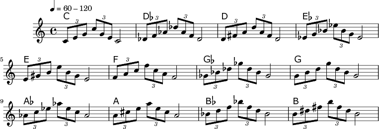

Jazz Pattern 1
==============

This is based on Patterns for Jazz (Pattern 1) by Coker, Casale,
Campbell, and Greene. This pattern cycles through all 12 keys in
increasing pitch order. It's one of the most basic patterns yet manages
to be interesting by having two 1/4-note tuplets (often associated with
the jazz idiom).

The following are required to use Abjad and the ipython noteboook
integration, which we are using to provide an annotated explanation to
how this and other patterns are built using Abjad.

.. code:: python

    from abjad import *
    %load_ext abjad.ext.ipython
sideman is a collection of helper classes/functions we have created,
specifically for working with these patterns. Almost all of the patterns
in our explorations are initially specified in C on treble clef
instruments, beginning with middle C (pitch 0). So we specify the
patterns using scale degrees and then transpose them into the key(s) of
interest.

In the following, c\_scale will include the pitches starting at middle
C.

.. code:: python

    import sideman
    c_scale = sideman.JazzScale(0)
get\_altered\_pitches\_as\_named() is a special method provided as part
of the JazzScale class that is specifically designed for working with
scale degrees (the way jazz musicians tend to think) and alterations
thereupon. You can specify a list of integral (scale degrees) or
strings. You can prefix any scale degree with any number of plus/minus
symbols to indicate any number of octaves to raise the note up or down.
So for example, in the C major scale, degree 1 is the first degree (or
middle C). "+1" is the C one octave higher than C. "++1" is two octaves
up, etc. You may also append "f" or "s" to indicate a sharped/flatted
degree. e.g. one of the most famous alterations is the sharped 4th or
the flat 5th. So you could write this as "4s" or "5f", respectively.

As you can see below, we are getting c', e', g', c'', g', e', c'. "+1"
gives us the higher C.

.. code:: python

    pitches = c_scale.get_altered_pitches_as_named([1, 3, 5, "+1", 5, 3, 1])
    print(pitches)

.. parsed-literal::

    [NamedPitch("c'"), NamedPitch("e'"), NamedPitch("g'"), NamedPitch("c''"), NamedPitch("g'"), NamedPitch("e'"), NamedPitch("c'")]

It probably goes without saying, but thinking in terms of scale degrees
(with alterations) is easier than thinking in terms of pitches. This
example might not do complete justice to the concept, given the
simplicity of our first pattern. Later patterns take advantage of a
significant number of alterations, which will make this indispensible.

.. code:: python

    pitches = c_scale.get_altered_pitches([1, 3, 5, "+1", 5, 3, 1])
    print(pitches)

.. parsed-literal::

    [0, 4, 7, 12, 7, 4, 0]

The first pattern works as follows. It's a 4/4 pattern. That is, the
entire pattern occupies one 4/4 measure. The first beat is just a tuplet
(degrees 1, 3, and 5 in key of C). The second beat is also a tuplet
(degrees +1, 5, 3) where 1 is raised an octave. The third (and fourth)
beat land on a half note.

We specify this by creating a list of durations that are in 1-1
correspondence and then passing both down to scoretools.make\_notes(),
which Abjad uses to *make music for us*.

One might wonder about exactly what might be going on with the tuplets
here? Many of these details are actually best left to the Abjad
documentation. The three eighth notes of the first tuplet (or triplet)
have a combined duration of 3/8. The fraction 2/3 is used to indicate
that this is a "3 against 2" Doing the math leads to
:math:`3/8 * 2/3 = 6/24 = 1/4`.

.. code:: python

    durations = [sideman.eighth] * 3 + [sideman.eighth] * 3 + [sideman.half]
    notes = scoretools.make_notes(pitches, durations)
.. code:: python

    t1_notes = notes[0:3]
    t2_notes = notes[3:6]
    last_note = notes[6]
    t1 = Tuplet(Fraction(2, 3), t1_notes)
    t2 = Tuplet(Fraction(2, 3), t2_notes)
    measure = Measure((4, 4))
    measure.append(t1)
    measure.append(t2)
    measure.append(last_note)
    show(measure)

.. code:: python

    pattern = Staff()
    pattern.append(measure)
    show(pattern)

So a big part of what we wanted to do from the beginning is to use Abjad
to make *lead sheets*. A lead sheet is what makes being a jazz musician
(or improviser in general) special. Typically, the lead sheet contains
the tune (in this case, a pattern) and the chord symbols. In this first
basic pattern, the chord symbol is telling you what chord (in this case
key) the pattern is in. You can kind of figure this out on your own by
looking at the notes that appear in the pattern but we wanted to follow
the tradition of patterns books in general by putting an appropriate
chord symbol at the top. While these chords are all just basic tonic
chords, later patterns will use more sophisticated chords. For example,
here is how to generate a C7 chord, built from the [1, 3, 5, 7] scale
degrees.

.. code:: python

    pitches = c_scale.get_altered_pitches([1, 3, 5, 7 ])
    print("Pitches from Altered", pitches)
    chord_measure = Measure( (4, 4))
    chord = Chord(pitches, (4, 4))
    chord_measure.append(chord)
    chords = Staff(context_name='ChordNames')
    chords.append(chord_measure)
    show(chords)

.. parsed-literal::

    Pitches from Altered [0, 4, 7, 11]

And here is how to generate the minor chord. We just do this by flatting
the 3rd degree of the major scale.

.. code:: python

    pitches = c_scale.get_altered_pitches([1, "3f", 5, 7 ])
    print("Pitches from Altered", pitches)
    chord_measure = Measure( (4, 4))
    chord = Chord(pitches, (4, 4))
    chord_measure.append(chord)
    chords = Staff(context_name='ChordNames')
    chords.append(chord_measure)
    show(chords)

.. parsed-literal::

    Pitches from Altered [0, 3, 7, 11]

Ok, both of these are cool, but we aren't in need of a 7th chord of any
kind right now. We just need an ordinary tonic chord as this is meant to
be one of the first patterns one would practice. Pianists: Just think of
putting C/E/G in the left hand and playing the pattern in the right hand
and you're set.

So we get the pitches for scaled degres [1, 3, 5] and make a chord out
of the underlying pitches for 4/4 time. Why? We want this chord to last
for the entire duration of the 4/4 pattern. When we switch the key in
the next measure, we'll generate the D-flat chord with exactly the same
pattern as used in C, simply starting at scale degree 1 (D-flat) of the
D-flat chord.

.. code:: python

    pitches = c_scale.get_chord_as_named([1 ,3, 5])
    chord_measure = Measure( (4, 4))
    chord = Chord(pitches, (4, 4))
    chord_measure.append(chord)
    chords = Staff(context_name='ChordNames')
    chords.append(chord_measure)
    show(chords)

.. code:: python

    show(chords)

.. code:: python

    show(pattern)

.. code:: python

    score = Score([chords, pattern]) 
    show(score)

.. code:: python

    import jazz001
.. code:: python

    score = jazz001.get_score()
.. code:: python

    show(score)

