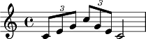
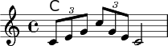

Pattern 1
============

.. code:: python

    from abjad import *
    %load_ext abjad.ext.ipython
.. code:: python

    import sideman
    c_scale = sideman.JazzScale(0)
.. code:: python

    pitches = c_scale.get_altered_pitches_as_named([1, 3, 5, "+1", 5, 3, 1])
    print(pitches)

.. parsed-literal::

    [NamedPitch("c'"), NamedPitch("e'"), NamedPitch("g'"), NamedPitch("c''"), NamedPitch("g'"), NamedPitch("e'"), NamedPitch("c'")]

.. code:: python

    pitches = c_scale.get_altered_pitches([1, 3, 5, "+1", 5, 3, 1])
    print(pitches)

.. parsed-literal::

    [0, 4, 7, 12, 7, 4, 0]

.. code:: python

    pitches = [0, 4, 7, 12, 7, 4, 0]
    durations = [sideman.eighth] * 3 + [sideman.eighth] * 3 + [sideman.half]
    notes = scoretools.make_notes(pitches, durations)
.. code:: python

    t1_notes = notes[0:3]
    t2_notes = notes[3:6]
    last_note = notes[6]
    t1 = Tuplet(Fraction(2, 3), t1_notes)
    t2 = Tuplet(Fraction(2, 3), t2_notes)
    measure = Measure((4, 4))
    measure.append(t1)
    measure.append(t2)
    measure.append(last_note)
    show(measure)

.. code:: python

    pattern = Staff()
    pattern.append(measure)
    show(pattern)

.. code:: python

    pitches = c_scale.get_chord_as_named([1 ,3, 5])
    chord_measure = Measure( (4, 4))
    chord = Chord(pitches, (4, 4))
    chord_measure.append(chord)
    chords = Staff(context_name='ChordNames')
    chords.append(chord_measure)
    show(chords)

.. code:: python

    show(chords)

.. code:: python

    show(pattern)

.. code:: python

    score = Score([chords, pattern]) 
    show(score)

